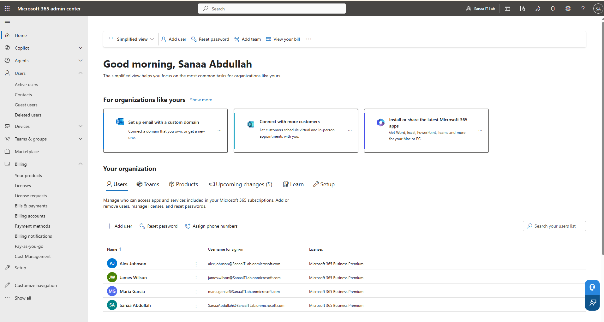
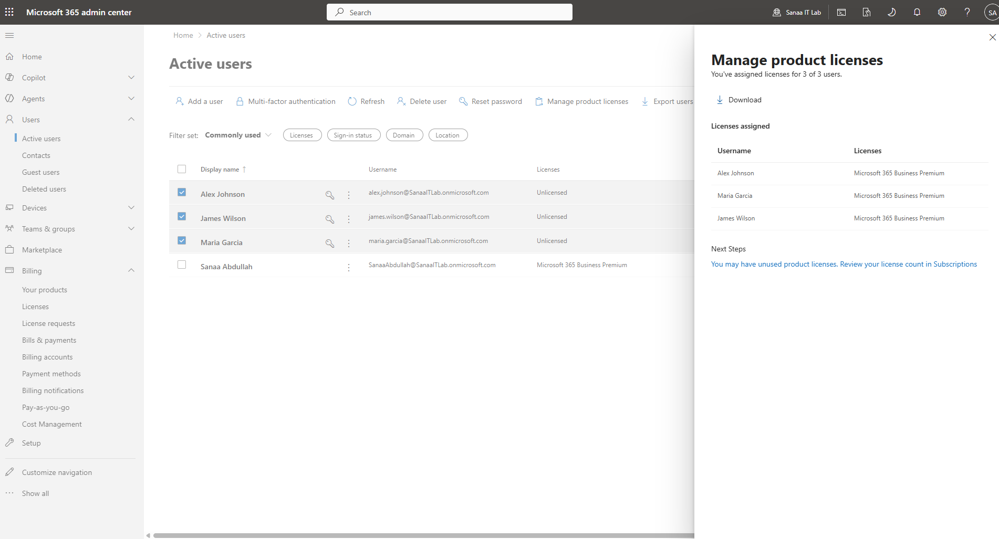

# Day 2 — Entra ID & User Management

**Date:** June 16, 2026
**Status:** ✅ Complete

---

## What I Did
- Explored Microsoft Entra ID admin centre
- Created 3 new users for Sanaa IT Lab
- Assigned Microsoft 365 Business Premium licences to all users
- Understood the difference between Entra ID and M365 Admin Centre

---

## Users Created

| Name | Username | Department | Job Title | Licence |
|---|---|---|---|---|
| Alex Johnson | alex.johnson@SanaaITLab.onmicrosoft.com | IT | IT Support Engineer | M365 Business Premium |
| Maria Garcia | maria.garcia@SanaaITLab.onmicrosoft.com | Finance | Finance Manager | M365 Business Premium |
| James Wilson | james.wilson@SanaaITLab.onmicrosoft.com | HR | HR Manager | M365 Business Premium |

---

## Key Lessons Learned

### What is Entra ID?
Microsoft Entra ID is the cloud identity platform that powers 
Microsoft 365. Every user, group, device and application in a 
Microsoft 365 tenant has an identity in Entra ID. It controls:
- Who people are (user identities)
- How they prove who they are (authentication)
- What they can access (authorisation)
- Security policies (MFA, Conditional Access)

### What is a User Principal Name (UPN)?
The UPN is a user's unique login address in the tenant. It follows 
the format username@domain.onmicrosoft.com. It works like an email 
address and is what the user types when signing in to any Microsoft 
365 service.

### What is a Licence?
A licence gives a user access to Microsoft 365 apps and services. 
Without a licence, a user account exists in the directory but the 
user cannot sign in or use any apps. Licences are assigned per user 
and cost money monthly — managing them carefully is an important 
part of IT cost management.

### Which portal does what?
| Task | Portal |
|---|---|
| Create users | entra.microsoft.com or admin.microsoft.com |
| Assign licences | admin.microsoft.com ONLY |
| Set MFA policies | entra.microsoft.com |
| Manage devices | intune.microsoft.com |
| View billing | admin.microsoft.com |

### User Types in Entra ID
| Type | What it means |
|---|---|
| Member | An employee inside your organisation |
| Guest | An external person invited to collaborate |
| Global Admin | Has full control over the entire tenant |
| Standard user | Regular employee with no admin rights |

---

## Real World Context
When a new employee joins a company, the IT admin must:
1. Create their user account in Entra ID
2. Set their username, department and job title
3. Set their usage location (required for licensing)
4. Assign the correct licence for their role
5. Add them to the right groups (next step)

Without completing all these steps, the new employee 
cannot access their email, Teams, or any company systems 
on their first day.

---

## Screenshots

