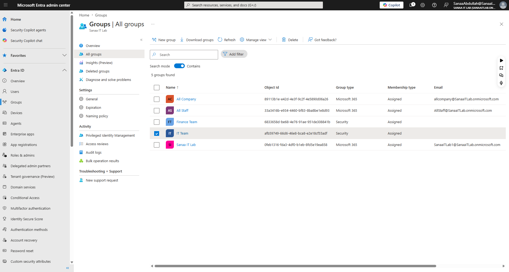
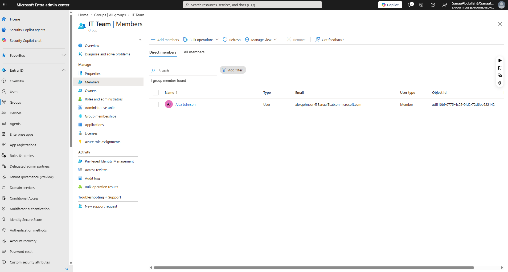

# Day 3 — Groups in Microsoft 365

**Date:** June 16, 2026
**Status:** ✅ Complete

---

## What I Did
- Explored the two auto-created groups in Entra ID
- Created 3 new groups for Sanaa IT Lab
- Added members to each group
- Understood the difference between Security and 
  Microsoft 365 groups

---

## Groups Created

| Group name | Type | Members | Purpose |
|---|---|---|---|
| IT Team | Security | Alex Johnson | IT security policies |
| Finance Team | Security | Maria Garcia | Finance security policies |
| All Staff | Microsoft 365 | Everyone | Company collaboration |

---

## Auto-Created Groups (by Microsoft)

| Group name | Type | Purpose |
|---|---|---|
| All Company | Microsoft 365 | Auto company-wide group |
| Sanaa IT Lab | Microsoft 365 | Auto company group |

---

## Key Lessons Learned

### What is a Group?
A group is a collection of users that can be managed together.
Instead of applying policies or permissions to each person 
individually, you add users to a group and manage the group.
This saves time and reduces errors — especially at scale.

### Security Group vs Microsoft 365 Group

| | Security Group | Microsoft 365 Group |
|---|---|---|
| Purpose | Access control & policies | Collaboration |
| Email address | ❌ No | ✅ Yes (auto-created) |
| Teams channel | ❌ No | ✅ Yes (auto-created) |
| SharePoint site | ❌ No | ✅ Yes (auto-created) |
| Use for MFA/CA policies | ✅ Yes | ❌ No |
| Use for team comms | ❌ No | ✅ Yes |

### Assigned vs Dynamic Membership

| | Assigned | Dynamic |
|---|---|---|
| How members are added | Manually by admin | Automatically by rules |
| Example rule | N/A | "Add all users where Department = Finance" |
| Best for | Small, controlled groups | Large organisations |
| Maintenance | Manual | Automatic |

### Group-Based Licensing
Instead of assigning licences to individual users, you can 
assign a licence to a group. Everyone in the group gets the 
licence automatically. When someone joins the group they get 
the licence. When they leave the group the licence is removed.
This is how large companies manage hundreds of licences 
efficiently.

### Why Groups Matter in Real Life
Groups are the foundation of everything in Microsoft 365:
- Apply MFA policies to a group → everyone in it gets MFA
- Apply Conditional Access to a group → controls their access
- Assign SharePoint permissions to a group → controls files
- Assign licences to a group → cost efficient management
- Target Intune policies to a group → manage their devices

---

## Sanaa IT Lab Full Structure After Day 3

### Users
| Name | Role | Department | Licence |
|---|---|---|---|
| Sanaa Abdullah | Global Admin | IT | M365 Business Premium |
| Alex Johnson | IT Support Engineer | IT | M365 Business Premium |
| Maria Garcia | Finance Manager | Finance | M365 Business Premium |
| James Wilson | HR Manager | HR | M365 Business Premium |

### Groups
| Group | Type | Members |
|---|---|---|
| IT Team | Security | Alex Johnson |
| Finance Team | Security | Maria Garcia |
| All Staff | Microsoft 365 | Everyone |

---

## Screenshots

