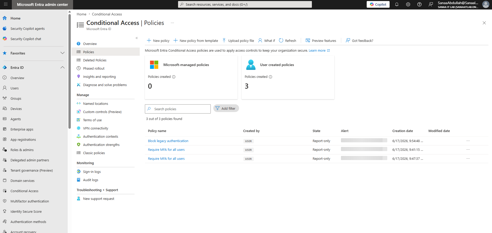
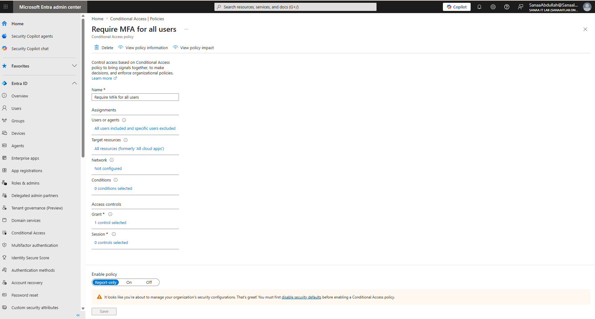
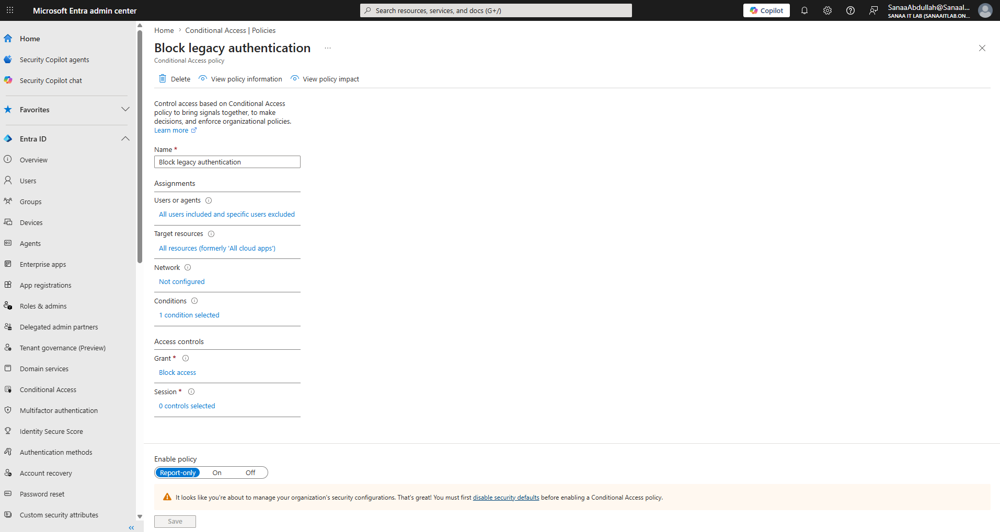

# Day 5 — Conditional Access

**Date:** June 17, 2026
**Status:** ✅ Complete

---

## What I Did
- Learned what Conditional Access is and why it's the 
  recommended approach over Per-user MFA
- Discovered and disabled Security Defaults to enable 
  Conditional Access
- Built 2 real Conditional Access policies in Report-only 
  (safe testing) mode

---

## What is Conditional Access?
Conditional Access is IF-THEN logic that controls access 
based on real-time conditions rather than a simple on/off 
switch. Instead of requiring MFA for every single sign-in 
no matter what, Conditional Access can apply different rules 
based on location, device, risk level, and application.

Example logic:
IF user signs in from outside the company network
THEN require MFA

IF user is using a legacy/old authentication protocol
THEN block access completely

---

## Security Defaults vs Conditional Access

| | Security Defaults | Conditional Access |
|---|---|---|
| Cost | Free | Requires Entra ID P1 |
| Customisation | None — basic on/off | Fully customisable |
| Default state | On for new tenants | Must build manually |
| Use case | Small orgs, quick start | Real companies, enterprise |

Important: These two features cannot run at the same time. 
Security Defaults must be disabled before Conditional Access 
policies can be enabled.

---

## Policies Built

### Policy 1 — Require MFA for all users
| Setting | Value |
|---|---|
| Users | All users, excluding Sanaa Abdullah (admin) |
| Target resources | All resources |
| Grant | Require multifactor authentication |
| Mode | Report-only |

This policy replaces the manual Per-user MFA from Day 4 
with a smarter, centrally managed approach.

### Policy 2 — Block legacy authentication
| Setting | Value |
|---|---|
| Users | All users, excluding Sanaa Abdullah (admin) |
| Target resources | All resources |
| Conditions | Client apps: Exchange ActiveSync, Other clients |
| Grant | Block access |
| Mode | Report-only |

Legacy authentication protocols don't support MFA at all — 
they completely bypass it. Blocking legacy auth closes one 
of the most common attack paths used to compromise accounts, 
even when MFA is enabled elsewhere.

---

## Key Lesson — Why Exclude the Admin Account

Every Conditional Access policy I built excludes my own 
admin account (Sanaa Abdullah). This is a critical safety 
practice called a "break glass" account. If a policy is 
misconfigured and blocks everyone, having at least one 
admin excluded means I can always get back into the tenant 
to fix the problem. Without this, a mistake could 
permanently lock out the entire organisation including IT.

---

## Key Lesson — Report-only Mode

Never enable a brand new Conditional Access policy directly 
to "On". Report-only mode logs what WOULD have happened 
without actually blocking or enforcing anything. Real IT 
admins:
1. Build the policy in Report-only
2. Monitor sign-in logs for several days
3. Confirm no legitimate users are negatively affected
4. Only then switch the policy to "On"

---

## Screenshots

