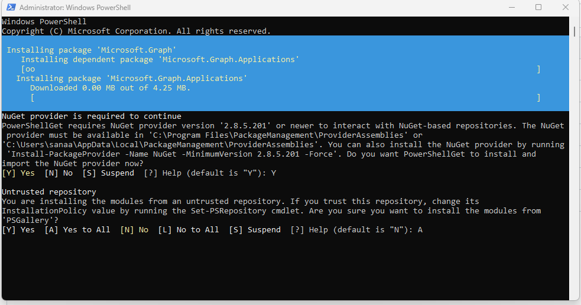
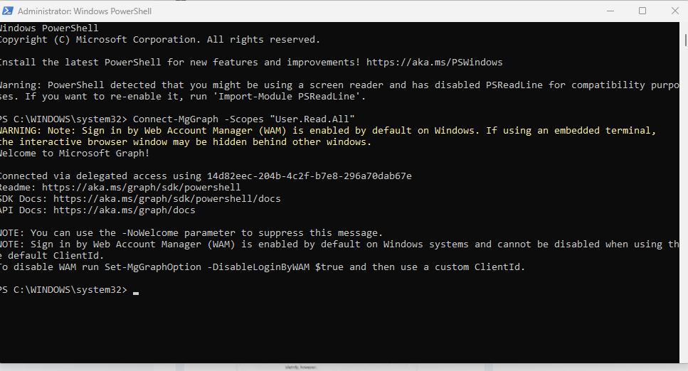
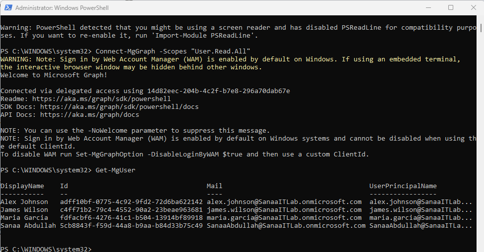
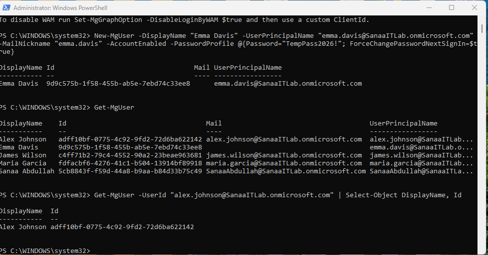

# Day 6 — PowerShell for Microsoft 365

**Date:** June 17, 2026
**Status:** ✅ Complete

---

## What I Did
- Installed the Microsoft.Graph PowerShell module
- Connected PowerShell to my Sanaa IT Lab tenant
- Queried, filtered, and formatted user data
- Created a new user (Emma Davis) entirely through code
- Looked up specific users by their UPN
- Disconnected the session cleanly

---

## Why PowerShell Matters
Manually clicking through a portal works fine for one or 
two users, but doesn't scale. PowerShell lets an admin 
perform the same action on 1 user or 1,000 users with the 
same amount of effort — this is why every Microsoft 365 
admin job lists PowerShell as a core skill.

---

## What is Microsoft Graph?
Microsoft Graph is the API that powers every Microsoft 365 
service — Entra ID, Exchange, Teams, SharePoint, Intune. 
Every click in the web portals is actually calling Microsoft 
Graph behind the scenes. The Microsoft.Graph PowerShell 
module lets an admin call those same APIs directly through 
code instead of clicking through a website.

---

## Commands Used

### Connect to the tenant
```powershell
Connect-MgGraph -Scopes "User.Read.All"
```
Authenticates PowerShell against the tenant with read-only 
permission, following the principle of least privilege — 
only request the access actually needed for the task.

### View all users
```powershell
Get-MgUser
```

### Filter to specific columns
```powershell
Get-MgUser | Select-Object DisplayName, Mail, UserPrincipalName
```
The pipe (`|`) passes the output of one command into the 
next — a core PowerShell concept used everywhere.

### Filter to a specific user
```powershell
Get-MgUser -Filter "DisplayName eq 'Alex Johnson'"
```

### Reconnect with write permissions
```powershell
Connect-MgGraph -Scopes "User.ReadWrite.All"
```

### Create a new user
```powershell
New-MgUser -DisplayName "Emma Davis" `
  -UserPrincipalName "emma.davis@SanaaITLab.onmicrosoft.com" `
  -MailNickname "emma.davis" `
  -AccountEnabled `
  -PasswordProfile @{Password="TempPass2026!"; ForceChangePasswordNextSignIn=$true}
```

### Look up a user by UPN
```powershell
Get-MgUser -UserId "alex.johnson@SanaaITLab.onmicrosoft.com" | Select-Object DisplayName, Id
```

### Disconnect safely
```powershell
Disconnect-MgGraph
```

---

## Key Lessons Learned

### Object IDs
Every object in Entra ID (users, groups, devices) has a 
permanent unique ID (GUID) that never changes, even if the 
display name does. Real automation scripts reference objects 
by ID, not by name, for reliability.

### Principle of Least Privilege
Only request the exact permission scopes needed for the task 
— start with read-only access, and only request write access 
when actually creating or modifying something.

### Consent Screens
Every time an app requests permissions, the user must 
explicitly approve them. "Consent on behalf of organization" 
applies the approval to every user in the tenant, not just 
the person clicking — a setting that should be used carefully 
and deliberately, never by default.

---

## Sanaa IT Lab — Final User Count After Day 6

| Name | Created via | Department |
|---|---|---|
| Sanaa Abdullah | Portal (initial setup) | IT (Admin) |
| Alex Johnson | Portal | IT |
| Maria Garcia | Portal | Finance |
| James Wilson | Portal | HR |
| Emma Davis | **PowerShell** | Marketing |

---

## Screenshots




